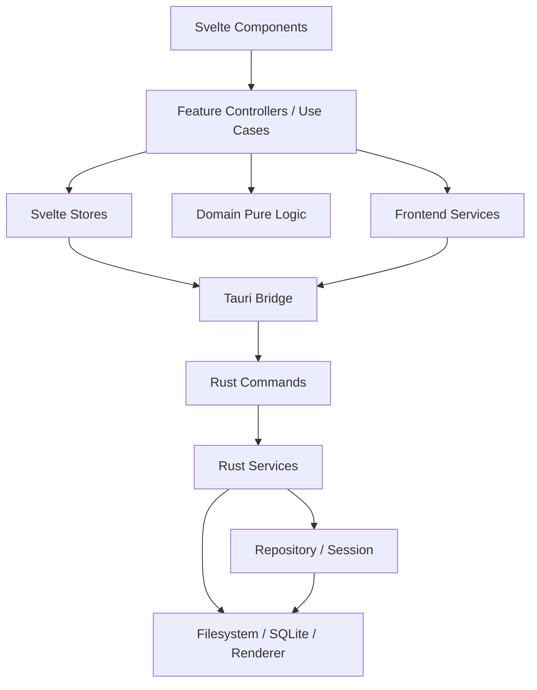
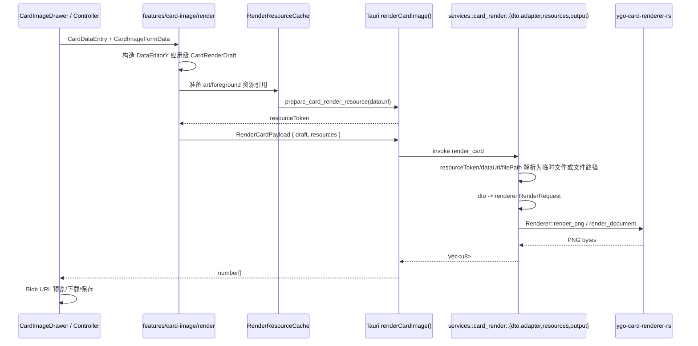
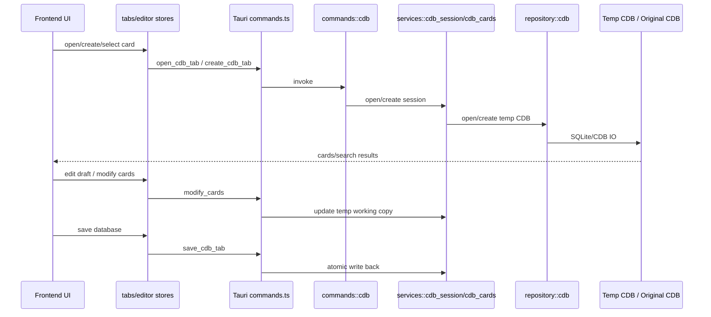

# DataEditorY 当前项目模块功能文档

生成时间：2026-05-18  
更新时间：2026-05-19
适用范围：当前 `DataEditorY` 仓库，包含 Svelte/Tauri 前端、Rust 后端、CDB 编辑、Lua 脚本编辑、制卡器、AI、打包与合并功能。

## 1. 项目定位

DataEditorY 是一个用于编辑 YGOPro `.cdb` 数据库的桌面应用。项目采用 Tauri 2 桌面壳，前端使用 Svelte 5 + TypeScript，后端使用 Rust 处理本地文件、SQLite/CDB、资源打包、数据库合并和卡图渲染。

项目提供两个构建变体：

| 变体 | 定位 | 特性 |
| --- | --- | --- |
| `base` | 基础 CDB 编辑器 | 打开/创建/搜索/编辑 `.cdb`，Lua 脚本编辑，打包/合并 |
| `extra` | 完整功能版 | 在 `base` 基础上增加制卡器与 AI 功能 |

## 2. 技术栈与运行边界

| 层 | 技术 | 说明 |
| --- | --- | --- |
| 前端框架 | SvelteKit 2 / Svelte 5 | 使用静态适配，`src/routes/+layout.ts` 关闭 SSR |
| 前端语言 | TypeScript | 业务逻辑、状态、控制器、工具函数 |
| 桌面壳 | Tauri 2 | 前端通过 Tauri IPC 调用 Rust 命令 |
| 后端语言 | Rust 2021 | 本地文件、SQLite/CDB、资源处理、渲染 |
| 数据库 | SQLite / YGOPro CDB | 通过 `ygopro-cdb-encode-rs` 操作 |
| 卡图渲染 | `ygo-card-renderer-rs` | Rust 侧卡图渲染库；当前适配层需要完全重构 |
| 编辑器 | Monaco Editor | Lua 脚本编辑器、补全、诊断、hover |
| 包管理 | Bun | 前端依赖、测试、构建脚本 |

## 3. 顶层目录职责

```text
src/                    Svelte 前端源码
src/lib/                前端业务、状态、组件、工具、服务
src/routes/             SvelteKit 页面入口
src-tauri/              Tauri/Rust 后端
scripts/                构建、变体配置、Lua 智能目录生成脚本
static/resources/       内置资源：Lua 手册、常量、snippet、strings、cover、pack.db
docs/                   项目架构与重构文档
```

## 4. 总体架构

项目整体是单体桌面应用，但内部采用较清晰的分层结构：



### 4.1 前端分层

| 层 | 目录 | 职责 |
| --- | --- | --- |
| 领域层 | `src/lib/domain/` | 纯业务逻辑：卡片草稿、setcode、搜索表达式、脚本工作区 |
| 应用层 | `src/lib/application/` | workspace 命令总线、生命周期、capability 注册 |
| 核心状态层 | `src/lib/core/workspace/` | workspace document 类型、全局 workspace store、UI 投影 |
| 状态层 | `src/lib/stores/` | 编辑器、标签页、搜索、设置、脚本编辑器、撤回等运行时状态 |
| 功能层 | `src/lib/features/` | 按功能组织 controller / useCases / components |
| 服务层 | `src/lib/services/` | 跨功能复用的应用服务，如脚本、卡图、AI 上下文 |
| 基础设施层 | `src/lib/infrastructure/` | Tauri IPC 适配 |
| 工具层 | `src/lib/utils/` | 通用工具，如卡片字段、setcode、快捷键、媒体协议、错误日志 |
| UI 组件层 | `src/lib/components/` | 顶级复用组件和功能入口组件 |

### 4.2 Rust 后端分层

| 层 | 目录 | 职责 |
| --- | --- | --- |
| 入口 | `src-tauri/src/main.rs` / `lib.rs` | Tauri 应用启动、插件注册、命令注册、全局状态管理 |
| 命令层 | `src-tauri/src/commands/` | Tauri IPC 命令，原则上保持薄封装 |
| 服务层 | `src-tauri/src/services/` | CDB、媒体、设置、打包、合并、渲染等后端业务逻辑 |
| 模型层 | `src-tauri/src/models/` | Rust ↔ 前端序列化 DTO |
| 仓储层 | `src-tauri/src/repository/` | CDB/SQLite 持久化访问适配 |
| 会话层 | `src-tauri/src/session/` | 打开的 CDB 会话、临时工作副本、路径工具 |

## 5. 前端模块功能文档

### 5.1 路由入口

| 文件 | 职责 |
| --- | --- |
| `src/routes/+layout.svelte` | 应用整体布局入口，加载全局样式、i18n、shell |
| `src/routes/+layout.ts` | 关闭 SSR，使应用作为桌面 SPA 运行 |
| `src/routes/+page.svelte` | 主页面入口，承载编辑器工作区 |

### 5.2 `src/lib/components/` 顶级组件

| 组件 | 功能 |
| --- | --- |
| `CardEditor.svelte` | 卡片编辑主界面组合，连接卡片列表、编辑表单、制卡入口等 |
| `CardList.svelte` | 左侧卡片列表/搜索结果展示，处理选择、分页、批量选择 |
| `CardImageDrawer.svelte` | 制卡器抽屉 UI，组合预览、字段编辑、裁剪、前景编辑 |
| `LuaScriptEditor.svelte` | Lua 脚本编辑器顶层容器，组合 toolbar、tabbar、Monaco 编辑区 |
| `SettingsPanel.svelte` | 设置页面顶层容器 |
| `SetcodeField.svelte` | setcode 输入与展示控件 |
| `Toast.svelte` | 全局 toast 消息展示 |

### 5.3 `features/shell` 应用壳模块

职责：应用级编排，包括窗口、标签、全局快捷键、拖拽打开、最近记录、打包/合并/过滤 CDB 对话框。

| 文件/目录 | 功能 |
| --- | --- |
| `controller.ts` | shell 通用工具，如文件路径过滤、可编辑目标判断、undo 触发判断 |
| `layoutController.svelte.ts` | shell 主控制器：主题、语言、拖拽、关闭保护、复制/粘贴/删除、workspace 激活 |
| `dialogsController.svelte.ts` | 打包/合并/创建过滤 CDB 等对话框状态与后台任务标题 |
| `packageController.ts` | ZIP/YPK 打包流程，导出前处理脏数据保存 |
| `mergeController.ts` | 多 CDB 来源收集、优先级排序、合并分析、合并执行 |
| `filterCdbController.ts` | 从当前搜索结果创建过滤后的 CDB，可选择复制图片/脚本资源 |
| `dialogsHelpers.ts` | merge key、输出路径校验等小工具 |
| `components/AppTopBar.svelte` | 顶部栏：打开/创建/合并/设置/主题/语言/打包 |
| `components/AppTabBar.svelte` | workspace 标签栏，管理 DB/脚本/设置标签 |
| `components/RecentHistoryPopover.svelte` | 最近打开记录弹窗 |
| `components/FileDragOverlay.svelte` | 拖拽文件时的覆盖层提示 |
| `components/dialogs/*` | 合并 CDB、创建过滤 CDB 对话框 |

### 5.4 `features/card-editor` 卡片编辑模块

职责：当前卡片草稿的编辑、保存、删除、搜索、脚本入口、制卡器入口、AI 稿件处理入口。

| 文件/目录 | 功能 |
| --- | --- |
| `controller.ts` | 卡片编辑纯控制逻辑：草稿初始化、dirty 判断、undo、图片预览、导航 |
| `useCases.ts` | 保存/修改/删除/打开脚本等标准卡片编辑用例 |
| `extraUseCases.ts` | `extra` 功能：导入卡图、AI 脚本生成、AI 稿件解析、AI 指令模式 |
| `lifecycle.ts` | 编辑器挂载/卸载、响应式同步、dirty guard、setcode 加载 |
| `searchController.ts` | 从当前草稿生成搜索条件、重置搜索 |
| `components/CardEditorForm.svelte` | 主编辑表单：基础字段、type bits、描述、攻守、属性等 |
| `components/CardEditorHeader.svelte` | 卡片 ID/Alias/名称区与保存/新卡入口 |
| `components/CardEditorFooter.svelte` | 底部操作区：搜索、AI、脚本、制卡、修改/删除 |
| `components/CardCategoryPopover.svelte` | category 位标志编辑弹窗 |
| `components/CardImagePreview.svelte` | 卡图预览弹层 |
| `components/CardImageDrawerHost.svelte` | 制卡器抽屉的懒加载入口 |
| `components/CardParseDialog.svelte` | AI 稿件解析/指令模式对话框 |

### 5.5 `features/card-image` 制卡器模块

职责：从 CDB 卡片数据生成制卡表单，支持图像上传裁剪、前景叠加、文字样式、预览、导出 PNG/JPG、保存到 `pics/`。

| 文件/目录 | 功能 |
| --- | --- |
| `adapter.ts` | `CardDataEntry` → 制卡表单默认值转换；处理语言、种族/类型文案、灵摆文本拆分 |
| `layout.ts` | 制卡表单 schema、默认值、选项列表、配置导入/导出序列化 |
| `controller.svelte.ts` | 制卡器主控制器；创建状态、注册响应式 effect、组合各子 controller |
| `ai/controller.ts` | 制卡器 AI 翻译准备、调用与结果写回 |
| `config/controller.ts` | 制卡配置导入/导出、文件选择、导入后状态同步 |
| `form/controller.ts` | 表单 patch、选项文案、名称颜色预设、导出倍率与配置文件名 |
| `session/controller.ts` | 抽屉开关、卡片 hydration、语言默认值切换和会话级重置 |
| `state.ts` | 制卡器初始状态工厂 |
| `media/controller.ts` | 原图与前景图 object URL 生命周期、data URL 到可渲染 URL 转换 |
| `resize/controller.ts` | 预览区与前景编辑区 ResizeObserver 管理 |
| `render/` | 应用级渲染请求、资源缓存、Tauri 渲染 client、PNG/JPG blob 转换 |
| `render/controller.ts` | 预览刷新、预览缩放、资源缓存生命周期、PNG/JPG 导出编排 |
| `render/dependencies.ts` | Svelte 预览刷新依赖追踪 |
| `render/export.ts` | PNG 下载、JPG 保存、场地魔法额外图片输出 |
| `crop/geometry.ts` | 裁剪舞台尺寸、旋转、裁剪框移动/缩放等纯几何逻辑 |
| `crop/controller.ts` | 裁剪弹窗状态、图片读取、裁剪输出、裁剪框事件处理 |
| `foreground/geometry.ts` | 前景图编辑器缩放、选区样式、拖拽移动/缩放/旋转等纯几何逻辑 |
| `foreground/controller.ts` | 前景图编辑状态、上传、预览测量、拖拽事件处理 |
| `foreground/image.ts` | 前景图读取和透明边界裁切 |
| `scriptRenderer.ts` | Lua 代码图片渲染器，与卡图渲染主线无关 |
| `components/CardImageCanvas.svelte` | 卡图预览、裁剪、前景编辑画布外壳 |
| `components/CardImageControls.svelte` | 上传、导入/导出配置、保存、下载、AI 翻译按钮区 |
| `components/CardImageFieldEditor.svelte` | 制卡字段表单，包含文字、稀有度、前景、效果框等设置 |
| `*.test.ts` | layout、render payload/data/blob、crop geometry、foreground geometry 等单元测试 |

当前卡图渲染管线：



当前状态：`renderRequestMapper.ts` 已移除，前端不再构造 renderer crate 内部请求；Rust `card_render` 已拆分为 dto/adapter/resources/bundle/output；制卡器 controller 已拆为 ai/config/crop/foreground/form/media/render/resize/session/state 等边界；前景图 overlay 已改为 `foregroundLayer` DTO + Rust `PositionedRenderImage` 定位，不再由前端 canvas 预合成整张 overlay；渲染 DTO 已通过 Rust `ts-rs` 生成 `src/lib/types/generated/render.ts`，`types/render.ts` 只保留类型转发；共享 JSON fixture 已同时覆盖 TS/Rust DTO 契约，并补了真实 renderer PNG smoke 与 committed PNG pixel snapshot。

### 5.6 `features/script-editor` Lua 脚本编辑模块

职责：脚本文件打开/保存、多标签、Monaco 编辑器集成、Lua 语义分析、补全、诊断、hover、引用手册、脚本生成。

| 文件/目录 | 功能 |
| --- | --- |
| `controller.ts` | 编辑器 UI 辅助逻辑：hint、overlay、快捷键、诊断排序、decorations |
| `useCases.ts` | 脚本打开、保存、重载、外部打开、分享/导出等流程 |
| `runtime.ts` | Monaco runtime 创建与主题/事件绑定 |
| `view.ts` | 从卡片上下文派生脚本图片导出元数据 |
| `monaco/setup.ts` | Monaco Lua 语言、补全、hover、诊断、主题初始化 |
| `monaco/completion.ts` | Lua 函数补全参数规范化、引用启发式判断 |
| `lua/semantic.ts` | Lua 语义模型主入口：解析、作用域、符号、引用、诊断、hover、调用信息 |
| `lua/catalog.ts` | Lua 常量/函数/片段目录加载 |
| `lua/calls.ts` | 内联函数调用高亮辅助 |
| `lua/scope.ts` | Lua 作用域和 range 工具 |
| `lua/reference.ts` | 函数/常量手册数据加载与搜索项构造 |
| `lua/referenceInsert.ts` | 引用手册插入文本与方法调用语法转换 |
| `lua/diagnostics.ts` | Lua 诊断分析封装 |
| `lua/symbols.ts` | 脚本文档符号提取 |
| `components/*` | Toolbar、TabBar、SidePanel、Monaco Core、诊断弹层、引用弹层、空状态等 UI |

### 5.7 `features/settings` 设置模块

职责：应用设置表单、AI 配置、脚本模板、外部编辑器、图片本地保存、打包规则、快捷键、封面、日志。

| 文件/目录 | 功能 |
| --- | --- |
| `controller.ts` | 设置表单状态、hydration、dirty 判断、校验、自动连接判断 |
| `useCases.ts` | 封面选择/清除、保存设置、打开错误日志 |
| `extraUseCases.ts` | AI 连接、模型保存、密钥清除、自动连接、提示文本 |
| `components/SettingsAiCard.svelte` | AI Provider/Base URL/Model/API Key/连接状态 |
| `components/SettingsTemplateCard.svelte` | 脚本模板、外部编辑器、图片保存设置 |
| `components/SettingsPackageCard.svelte` | 打包 include pattern 编辑 |
| `components/SettingsShortcutsCard.svelte` | 快捷键绑定与冲突检测 |
| `components/SettingsCoverAndLog.svelte` | 自定义封面与错误日志路径 |
| `components/SettingsHeader.svelte` | 设置页标题和保存按钮 |

### 5.8 `features/ai` AI 模块

职责：为 AI 功能提供工具调用能力。

| 文件 | 功能 |
| --- | --- |
| `service.ts` | AI 工具定义、卡片序列化、批量编辑、稿件解析、脚本生成、chat completions 编排 |

### 5.9 `stores` 状态模块

| 文件 | 功能 |
| --- | --- |
| `appSettings.svelte.ts` | 持久化设置、AI 连接状态 |
| `appShell.svelte.ts` | 全局 UI 视图状态：编辑器/设置/脚本 |
| `editor.svelte.ts` | 当前卡片列表、选择、搜索结果缓存与搜索执行编排 |
| `searchState.svelte.ts` | 搜索 UI 状态：filters、当前页、规则错误、过滤面板开关 |
| `tabs.ts` | CDB 标签生命周期、缓存、保存、打开、关闭、激活 |
| `search.ts` | 搜索 IPC 执行、source filter 缓存、搜索快照监听 |
| `scriptEditor.svelte.ts` | 脚本标签、active tab、dirty、保存/重载/关闭 |
| `cardOperations.ts` | 卡片 CRUD/query Tauri wrapper、缓存刷新、undo 记录 |
| `cardUtils.ts` | 卡片深拷贝工具 |
| `undo.ts` | 每个 DB 标签独立的 undo stack |
| `recentHistory.ts` | localStorage 最近打开历史 |
| `cardClipboard.svelte.ts` | 内存中的复制卡片剪贴板 |
| `toast.svelte.ts` | Toast 队列 |
| `db.ts` | DB 相关 store/API 聚合导出 |

### 5.10 `services` 前端服务模块

| 文件 | 功能 |
| --- | --- |
| `aiAppContext.ts` | AI service 与 stores/infrastructure 的适配层 |
| `cardImageService.ts` | `pics/` 路径解析、卡图导入辅助 |
| `cardScriptService.ts` | 脚本文件发现、打开、外部编辑器集成 |
| `scriptGeneration.ts` | AI 脚本生成服务：覆盖检查、写入文件、tab 同步 |
| `scriptGenerationStages.ts` | 脚本生成阶段共享类型/文案 |
| `scriptTemplate.ts` | 脚本模板应用封装 |
| `setcodeCatalog.ts` | setcode catalog 加载与索引 |

### 5.11 `domain` 领域逻辑模块

| 文件/目录 | 功能 |
| --- | --- |
| `card/draft.ts` | 卡片草稿标准化、快照、序列化、等价判断 |
| `card/setcode.ts` | setcode 解析、格式化、拆分 |
| `card/taxonomy.ts` | 卡片 type/race/attribute/link marker 位标志表 |
| `search/query.ts` | 从搜索条件构造 SQL WHERE |
| `search/ruleExpression.ts` | 规则表达式解析和校验 |
| `search/sourceFilters.ts` | 图片文件夹、卡组文本 source filter 解析 |
| `script/workspace.ts` | 脚本路径、文件名、内容标准化、模板应用 |

### 5.12 `application` 与 `core/workspace`

| 文件/目录 | 功能 |
| --- | --- |
| `application/capabilities/*` | 功能能力注册与启用判断，支持 base/extra 差异 |
| `application/workspace/commandBus.ts` | 打开、关闭、保存、激活 workspace 文档的命令入口 |
| `application/workspace/lifecycle.ts` | dirty-close guard、保存处理器 |
| `core/workspace/types.ts` | workspace 文档类型定义 |
| `core/workspace/store.svelte.ts` | 全局 workspace document registry |
| `core/workspace/projection.ts` | workspace 状态到 UI 标签/面板的投影 |

### 5.13 `infrastructure/tauri`

| 文件 | 功能 |
| --- | --- |
| `index.ts` | 对 `@tauri-apps/api/core.invoke` 的薄封装 |
| `commands.ts` | 前端侧 Tauri command wrapper，包括 CDB、文件、脚本、设置、打包、合并、渲染 |

当前需要重点改进：渲染链路已用 Rust DTO 自动生成 TypeScript 类型；其他复杂 Rust IPC 类型契约仍依赖双端手写字段，需要按同一模式继续治理。

### 5.14 `utils` 工具模块

| 类别 | 文件 | 功能 |
| --- | --- | --- |
| 卡片 | `card.ts` | 卡片字段格式化、选项映射 |
| 媒体 | `mediaProtocol.ts` | 本地路径转 Tauri media protocol URL，带 cache bust |
| setcode | `setcode.ts` | setcode 工具函数 |
| 快捷键 | `shortcuts.ts` | 快捷键 dispatch 工具 |
| 错误日志 | `errorLog.ts` | 前端错误写入后端日志 |

## 6. Rust 后端模块功能文档

### 6.1 入口与应用状态

| 文件 | 功能 |
| --- | --- |
| `main.rs` | 原生入口，仅调用 `dataeditory_lib::run()` |
| `lib.rs` | Tauri Builder、插件注册、URI protocol、命令注册、全局状态注册 |

全局状态：

| 状态 | 功能 |
| --- | --- |
| `PendingOpenCdbPaths` | 启动参数/单实例传入的待打开 `.cdb` 路径队列 |
| `OpenCdbSessions` | 当前打开的 CDB 标签与临时工作副本映射 |

### 6.2 `commands` IPC 命令层

| 文件 | 功能 |
| --- | --- |
| `app.rs` | 错误日志追加、消费 pending open paths |
| `cdb.rs` | CDB 打开/创建/关闭/保存、搜索、查询、修改、删除、导出、资产复制、合并、undo |
| `media.rs` | 文件读写、图片列表/读取/复制/导入、strings 加载、系统打开 |
| `package.rs` | CDB 资源打包为 ZIP/YPK |
| `render_card.rs` | 卡图渲染命令，代理到 `services::card_render` |
| `scripts.rs` | 卡片脚本信息、读取、写入、保存 |
| `settings.rs` | 设置加载/保存、密钥加载、封面设置/清除 |

### 6.3 `services` 后端服务层

| 文件 | 功能 |
| --- | --- |
| `app_config.rs` | app config 路径、设置文件、日志、默认模板、路径规范化 |
| `assets.rs` | 卡图、场地图、脚本资源复制 |
| `card_render/` | Rust 卡图渲染服务：dto、adapter、bundle、resources、output、局部错误模型 |
| `cdb_cards.rs` | CDB 内容查询、分页搜索、修改、删除、创建、undo、局部错误模型 |
| `cdb_session.rs` | CDB tab 生命周期、临时工作副本、保存写回 |
| `crypto.rs` | API Key AES-GCM 加密/解密、legacy key 迁移 |
| `logging.rs` | 结构化错误日志追加 |
| `media/` | 自定义 media protocol、文件 I/O、图片 I/O、strings 加载、系统打开、启动参数路径收集 |
| `merge.rs` | 多 CDB 合并计划、冲突分析、资产索引、合并执行 |
| `package.rs` | 打包 manifest、Lua 依赖解析、ZIP 输出 |
| `scripts.rs` | 卡片脚本路径、读取、写入、保存 |
| `settings.rs` | 设置保存/加载、封面文件管理、密钥处理 |

### 6.4 `models` DTO 模块

| 文件 | 功能 |
| --- | --- |
| `app.rs` | 应用设置、脚本文档、打包信息、后台任务进度、错误日志请求 |
| `cdb.rs` | 卡片 DTO、查询/修改/删除/合并/资产复制请求与响应 |

### 6.5 `repository` 与 `session`

| 文件 | 功能 |
| --- | --- |
| `repository/cdb.rs` | `ygopro-cdb-encode-rs` 适配层，打开/创建/读取/重建 CDB |
| `session/cdb.rs` | CDB 会话元数据、路径 canonicalize、临时目录、session 替换/移除/清理 |

## 7. 核心业务数据流

### 7.1 CDB 打开、编辑、保存



### 7.2 搜索

```text
UI 搜索条件
  -> stores/search.ts
  -> domain/search/query.ts 构造 SQL 条件
  -> Tauri search_cards_page
  -> Rust cdb_cards.rs
  -> ygopro-cdb-encode-rs / rusqlite
```

### 7.3 Lua 脚本编辑

```text
Card Editor 打开脚本
  -> cardScriptService / scriptEditor store
  -> Tauri get/read/write/save_card_script
  -> Rust services::scripts
  -> <cdb-dir>/script/c<code>.lua
```

### 7.4 打包与合并

```text
打包：Shell packageController -> package_cdb_assets_as_zip -> Rust package.rs -> ZIP/YPK
合并：Shell mergeController -> analyze/execute_cdb_merge -> Rust merge.rs -> 新 CDB + 资源
```

## 8. 测试现状

项目已有多处前端单元测试，主要覆盖纯逻辑和控制器逻辑：

| 区域 | 覆盖示例 |
| --- | --- |
| `domain/card` | 草稿标准化、setcode |
| `domain/search` | SQL 查询构造、规则表达式、source filter |
| `domain/script` | 脚本路径、模板、内容标准化 |
| `application/workspace` | 生命周期、projection、capabilities |
| `features/*` | card editor、settings、shell、script runtime/controller 部分逻辑 |
| `features/card-image` | layout/config roundtrip |

当前不足：卡图渲染适配层已有共享 JSON fixture 契约测试、真实 renderer PNG smoke 与 committed PNG pixel snapshot；后续仍可扩展更多卡种/语言的视觉样例。

## 9. 架构风险与优化点

### 9.1 IPC 类型契约：前端与 Rust 之间存在隐式约定

| 现状 | 影响 | 建议 |
| --- | --- | --- |
| `RenderCardPayload` 已从 `unknown` 改为应用级 DTO，并由 Rust `ts-rs` 生成 TypeScript 类型；共享 JSON fixture 同时覆盖 TypeScript 序列化与 Rust 反序列化 | 渲染链路字段漂移已被生成类型与 fixture 双重约束；其他命令仍可能漂移 | 将渲染 DTO 的生成模式推广到其他复杂 IPC DTO，继续保留关键 JSON fixture |
| 其他命令（modify_cards、query_cards_raw）也依赖手写字段匹配 | 同上 | 统一约定：前端保持 camelCase，Rust DTO 一律显式 `#[serde(rename_all = "camelCase")]`，禁止依赖默认行为 |

### 9.2 制卡器 controller 承载过多职责

| 现状 | 影响 | 建议 |
| --- | --- | --- |
| `controller.svelte.ts` 已从约 1800 行拆至约 255 行，主要负责状态创建、effect 注册和子 controller 编排 | 修改影响面已显著降低；后续风险集中在跨 controller 状态契约和真实 UI 回归验证 | 继续保持主 controller 只做编排；新增行为优先进入已有子模块或独立 controller，并为纯逻辑补测试 |

### 9.3 `renderRequestMapper.ts` 跨层泄露

前端直接构造 `ygo-card-renderer-rs` 的内部 `RenderRequest` 结构，违反了依赖方向——前端不应知道 Rust 渲染库的内部模型。应在重构中彻底替换为应用级 DTO。

### 9.4 features/utils 双向依赖与兼容层

| 现状 | 影响 | 建议 |
| --- | --- | --- |
| `utils/cardImage.ts` / `utils/cardImageAdapter.ts` 兼容重导出 | 已删除，引用方直接 import `features/card-image` 真实模块 | 保持新代码不再新增 `utils` 反向出口 |
| `utils/lua*.ts` 系列兼容重导出 | 已删除，主副本保留在 `features/script-editor/lua`、`features/script-editor/monaco` 与 `features/card-image/scriptRenderer` | 后续 Lua 新能力继续放在归属 feature 下 |
| `utils/ai.ts` 兼容重导出 | 已删除，引用方直接使用 `features/ai/service` | AI feature 继续作为 Prompt、解析、翻译、生成工具的主归属 |

### 9.5 `stores/editor.svelte.ts` 搜索与编辑状态耦合

| 现状 | 影响 | 建议 |
| --- | --- | --- |
| `searchState.svelte.ts` 已承接 filters、当前页、规则错误和过滤面板开关；`editor.svelte.ts` 仍负责编排搜索结果与选择状态 | 搜索 UI 状态已先从选择状态中拆出，响应式触发面缩小；搜索执行与选择保留在同一编排点以降低回归风险 | 后续可继续把搜索结果列表/total 与选择索引拆为更明确的 `searchResults` / `selection` store |

### 9.6 Rust 后端 `Result<T, String>` 遍布所有服务

| 现状 | 影响 | 建议 |
| --- | --- | --- |
| 很多 service 函数仍返回 `Result<T, String>`；`media` 已引入 `MediaError`/`MediaResult`，`card_render` 已引入 `RenderError`/`RenderResult`，`cdb_cards` 已引入 `CdbCardsError`/`CdbCardsResult` | 目标服务的错误边界已更清晰；剩余服务仍可能只能匹配字符串 | 后续按收益继续为 `cdb_session`、`assets`、`merge`、`package` 等服务引入局部错误枚举，仅在命令层统一转为前端可读字符串 |

### 9.7 `services/media` 模块边界

| 现状 | 影响 | 建议 |
| --- | --- | --- |
| 已从单一 `media.rs` 拆为 `media/protocol.rs`、`media/io.rs`、`media/image.rs`、`media/strings.rs`、`media/system.rs`，并补入 `media/error.rs` | 文件职责边界已清晰；服务内部错误已具备定位信息，命令层仍保持前端字符串错误兼容 | 保持 `services::media::*` 对外 API 稳定；剩余错误模型推广按其他服务收益继续排期 |

### 9.8 build stubs 模式的脆弱性

| 现状 | 影响 | 建议 |
| --- | --- | --- |
| `src/lib/build-stubs/base/` 放置 `extra` 功能的占位文件，构建时被文件系统级替换；主要 UI 入口已改由 capability registry 决策 | IDE 索引不友好，本地开发和 CI 行为仍可能不一致 | 继续把 stubs 收敛为编译兜底，后续减少 alias 面；运行时启用判断统一走 `application/capabilities` |

### 9.9 `application/capabilities` 系统利用不足

| 现状 | 影响 | 建议 |
| --- | --- | --- |
| capability registry 已接管 CardEditor、ScriptEditor、Settings、CardImage 入口的启用判断；可选模块动态 import 通过 capability 层导出的编译期布尔常量裁剪 | `base/extra` 运行时决策已更集中；剩余风险主要是 build alias 仍需要保留一段时间 | 保持组件/feature 入口不直接读取 `__APP_FEATURES__`、`HAS_EXTRA_BUILD`、`HAS_AI_FEATURE`，后续按模块继续缩小 build stubs |

### 9.10 Tauri event 利用率偏低

| 现状 | 影响 | 建议 |
| --- | --- | --- |
| 后端只在打包/合并时用 event 通知进度，其他操作同步返回 | 长时间渲染会阻塞 UI | 对渲染任务考虑异步模式：发起请求 → Rust 后台渲染 → event 推送结果 |

### 9.11 缺少跨模块的共享类型文件

| 现状 | 影响 | 建议 |
| --- | --- | --- |
| `CardDataEntry` 在 `types/index.ts`，脚本文件信息在 `types/script.ts`，渲染 DTO 在 `types/render.ts` | 核心跨模块类型已有主归属；剩余局部 UI 类型仍可按收益逐步收敛 | 继续保持 card data、script document、render draft 等跨模块类型集中在 `types/` 或 `domain/` 下 |

### 9.12 测试覆盖边界集中在纯逻辑

| 现状 | 影响 | 建议 |
| --- | --- | --- |
| 测试覆盖 `domain/`、部分 `application/`、少量 `features/`，IPC 层、Rust services、UI 交互仍偏薄 | 最复杂的集成点仍需要更多回归保护 | 优先补：CDB 合并冲突计算、打包 Lua 依赖解析、更多渲染卡种/语言样例 |

### 9.13 优化优先级分类

| 优先级 | 项目 | 理由 |
| --- | --- | --- |
| 高（渲染已完成试点） | IPC 类型契约（9.1） | 渲染 DTO 已建立 `ts-rs` 生成链路，后续可逐步推广到其他复杂命令 |
| 立即 | renderRequestMapper 跨层泄露（9.3） | 是当前渲染重构的核心范围 |
| 高（已完成本轮主要拆分） | controller 拆分（9.2） | 主 controller 已降为编排层，后续只需保持边界并补充回归验证 |
| 高 | utils 重导出清理（9.4） | 成本低，收益明确 |
| 中（目标服务已完成） | Rust 错误模型（9.6） | 影响所有后端代码的可维护性 |
| 中（已完成第一轮） | build stubs 简化（9.8） | 降低构建系统的认知负担 |
| 低 | stores 拆分（9.5） | 风险较低，可在其他稳定后再做 |
| 低 | 异步渲染（9.10） | 用户感知的性能提升在当前阶段不重要 |

## 10. 新功能放置建议

| 新功能类型 | 建议位置 |
| --- | --- |
| 纯业务规则 | `src/lib/domain/<domain>/` |
| 前端状态 | `src/lib/stores/` |
| 单个功能的 UI + 控制逻辑 | `src/lib/features/<feature>/` |
| 跨功能服务 | `src/lib/services/` |
| Tauri IPC wrapper | `src/lib/infrastructure/tauri/commands.ts` |
| Rust IPC 命令 | `src-tauri/src/commands/` |
| Rust 业务逻辑 | `src-tauri/src/services/` |
| CDB/SQLite 访问 | `src-tauri/src/repository/` |
| 打包/合并/渲染等本地重任务 | 优先 Rust services |

## 11. 维护原则

1. `commands` 保持薄封装，复杂逻辑放到 `services`。
2. `domain` 保持纯函数、无 UI/IO 依赖。
3. `features` 内 controller 负责交互编排，业务规则应尽量下沉到 domain/services。
4. 前端与 Rust 的 IPC 类型要显式定义，不应使用 `unknown` 作为长期契约。
5. `base` 与 `extra` 差异应通过 capability/build stubs 明确隔离。
6. 卡图渲染重构时应以 Rust renderer 为唯一渲染核心，前端只负责编辑参数与展示结果。
