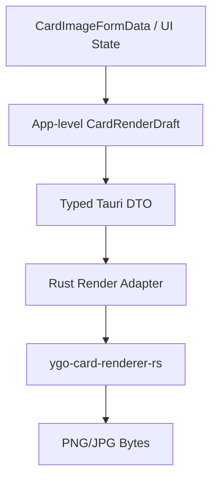

# DataEditorY 重构准备文档

生成时间：2026-05-18  
更新时间：2026-05-19
重构目标：为后续代码重构提供方向性文档。本文不包含逐行迁移步骤，重点描述重构目标、边界、目标架构、优先级与风险。

## 1. 总体重构目标

本轮重构以“稳定既有功能、降低维护成本、强化类型契约、为后续功能扩展提供清晰边界”为目标。

核心原则：

1. **行为保持一致**：尤其是 CDB 编辑、搜索、脚本编辑、打包、合并、制卡器导出行为，不应引入功能倒退。
2. **边界清晰**：区分 UI、controller、use case、domain、service、infrastructure。
3. **类型优先**：前端与 Rust 的 IPC 边界应有明确类型，不继续依赖 `unknown` 或隐式字段约定。
4. **重活下沉 Rust**：本地文件、图片处理、渲染、数据库、打包合并等重任务优先由 Rust 承担。
5. **可测试**：重构后的核心转换逻辑、IPC DTO、渲染请求构建、CDB 操作应可单独测试。

## 2. 重构范围分级

| 优先级 | 范围 | 说明 |
| --- | --- | --- |
| P0 | 卡图渲染完全重构 | 从 JS `yugioh-card` 迁移到 Rust `ygo-card-renderer-rs` 后，当前适配层应废弃重写，仅保留功能一致 |
| P1 | IPC 类型契约 | 前端 Tauri commands 与 Rust DTO 类型统一，消除 `unknown`；建立跨端类型同步机制 |
| P1 | 制卡器状态拆分 | 拆分巨型 `controller.svelte.ts`，降低 UI 状态、裁剪、前景、渲染耦合 |
| P2 | 前端模块边界清理 | 清理兼容重导出、减少 utils 与 features 双向依赖、统一共享类型位置 |
| P2 | Rust 错误模型统一 | 改善 `Result<_, String>` 的可维护性和错误定位 |
| P2 | Rust 服务模块细化 | 拆分 `media.rs`（职责过载）、`card_render.rs`（渲染重构同步） |
| P2 | capability 系统深化 | 让 capability registry 成为 base/extra 差异的唯一决策点，简化 build stubs |
| P3 | stores/editor 拆分 | 搜索状态与编辑状态解耦，降低响应式触发面 |
| P3 | 测试补齐 | 增加渲染契约、适配器、IPC DTO、CDB 合并计划、打包依赖解析测试 |
| P3 | Tauri event 异步模式 | 对耗时渲染任务考虑异步 event 推送，避免阻塞 UI |

## 3. 卡图渲染完全重构

### 3.1 背景

项目已从 JS 的 `yugioh-card` 切换到 Rust 的 `ygo-card-renderer-rs`。当前代码中已经存在基础接入：

- `src-tauri/Cargo.toml` 已依赖 `ygo-card-renderer-rs`
- `src-tauri/src/services/card_render/` 已拆分为 dto、adapter、resources、bundle、output
- `src/lib/features/card-image/render/` 已生成 DataEditorY 应用级渲染 draft/payload，并提供资源缓存与 Tauri client
- 前端通过 `renderCardImage()` 调用 Tauri `render_card`

当前实现已经完成第一阶段卡图渲染核心收口：旧 `renderRequestMapper.ts` 已移除，前端不再构造 renderer crate 内部结构，图片资源已开始使用 `resourceToken`/缓存，制卡器主 controller 已降为编排层，foreground overlay 已通过 `foregroundLayer` DTO 下沉到 Rust renderer/adapter，共享 fixture、真实 renderer PNG smoke、committed PNG pixel snapshot 已落地。渲染 DTO 已由 Rust `ts-rs` 生成 TypeScript 类型，后续重点转为：将类型生成模式推广到其他复杂 IPC DTO，并扩展更多卡种/语言的视觉样例。

### 3.2 当前问题

| 问题 | 当前状态 | 影响 |
| --- | --- | --- |
| 前端 `RenderCardPayload.request` 类型为 `unknown` | 已替换为 Rust DTO 生成的应用级 `RenderCardPayload`；`types/render.ts` 转发 `generated/render.ts`，并由共享 JSON fixture 覆盖 TS 序列化与 Rust 反序列化 | 卡图渲染链路已具备自动类型同步，后续可推广到其他 IPC DTO |
| `renderRequestMapper.ts` 手写 Rust 请求结构 | 已移除，改为 `render/draft.ts` + Rust `adapter.rs` | renderer crate API 漂移被收敛到 Rust adapter |
| 前端通过 canvas 合成 foreground overlay | 已移除，改为发送前景原图资源和 `foregroundLayer` placement，由 Rust `PositionedRenderImage` 合成 | 渲染职责进一步集中到 Rust；仍需真实渲染回归验证视觉一致性 |
| art/foreground 通过 data URL 传输 | Tauri 环境已优先 `resourceToken` 缓存，非 Tauri/测试保留 data URL fallback | 性能风险降低，但裁剪图和前景 overlay 的源头仍可能产生大 data URL |
| password 有额外 override 逻辑 | 已进入统一应用级 DTO | 请求语义已清理 |
| controller 同时管理裁剪、前景、导出、渲染刷新 | 已抽出 ai/config/crop/foreground/form/media/render/resize/session 子 controller，并将初始状态迁入 `state.ts`；主 controller 约 255 行，仅保留状态创建、effect 注册和模块编排 | 维护性明显改善，后续重点转为回归验证和保持边界 |
| 缺少渲染回归样例 | 已补 payload/data/blob/resource/geometry 单测、共享 DTO fixture、真实 renderer PNG smoke、committed PNG pixel snapshot，并对 foreground overlay 做像素采样 | 当前阶段已具备基本视觉回归保护；后续可扩展 spell/trap/pendulum/link 和多语言样例 |

### 3.3 重构目标

卡图渲染重构后应满足：

1. **Rust renderer 是唯一卡图渲染核心**。
2. **前端不再构造 renderer 内部细节对象**，只提交稳定的应用级制卡请求。
3. **前端不再合成最终渲染图层**，只负责编辑参数、裁剪源图、展示结果。
4. **前后端契约明确**，Rust DTO 与 TypeScript 类型保持一致。
5. **支持现有功能一致性**：预览、导出 PNG、保存 JPG、卡图裁剪、字段编辑、语言、稀有度、文字颜色/渐变/阴影、前景图、效果框、场地魔法额外场地图导出等行为需保留。
6. **性能可控**：避免频繁 base64 大对象传输；对重复图像资源有缓存或引用机制。

### 3.4 目标架构

建议将渲染体系改为三层：



#### 3.4.1 前端应用级请求

前端应提交面向 DataEditorY 的请求，而不是直接提交 `ygo-card-renderer-rs::RenderRequest` 的内部结构。

建议概念模型：

```text
CardRenderDraft
  cardIdentity
  cardFrame
  localizedText
  stats
  artSource
  visualStyle
  foregroundLayer
  effectBlock
  outputOptions
```

该模型应表达“用户在制卡器中编辑了什么”，而不是“Rust renderer 需要怎样的内部节点”。

#### 3.4.2 Rust 渲染适配器

Rust 侧新增或重写渲染 adapter：

```text
DataEditorY Render DTO
  -> normalize / validate
  -> convert to ygo-card-renderer-rs RenderRequest
  -> render
  -> encode output
```

这样 renderer crate 的 API 变化只影响 Rust adapter，不影响前端表单和 UI。

#### 3.4.3 图像资源传输

应避免长期使用 data URL 作为主通道。可选方向：

| 方案 | 说明 |
| --- | --- |
| 临时资源句柄 | 前端上传/裁剪后写入临时文件，渲染请求只传 path/token |
| Rust 管理渲染资源缓存 | Rust 根据 token 读取缓存图片，预览重复渲染不重复传大对象 |
| 一次性 binary IPC | 对小图可传 bytes，但不再转 base64 data URL |

最终目标是：渲染请求只携带轻量参数与资源引用。

### 3.5 必须保持的功能一致性

| 功能 | 保持要求 |
| --- | --- |
| 卡片类型 | monster/spell/trap/pendulum，含 ritual/fusion/synchro/xyz/link/token |
| 位标志语义 | type/race/attribute/link marker/category 与 CDB 语义一致 |
| 多语言 | sc/tc/jp/kr/en/astral 默认文案和格式化行为保持一致 |
| 灵摆 | 灵摆描述/怪兽效果拆分、刻度、灵摆框架保持一致 |
| 图片 | 上传、旋转裁剪、预览、导出、保存到 `pics/<code>.jpg` |
| 场地魔法 | 保存 JPG 时继续额外生成 `pics/field/<code>.jpg` |
| 文字 | 名称、描述、密码、版权、包名、rare、laser、20th 等字段保持一致 |
| 样式 | 名称颜色、渐变、阴影、首行压缩、效果框、前景图保持一致 |
| 输出 | 预览 PNG、下载 PNG、保存 JPG 质量与尺寸策略保持可接受一致 |

### 3.6 重构后建议模块划分

#### 前端

```text
src/lib/features/card-image/
  adapter.ts                    CDB CardDataEntry -> 制卡表单默认值
  layout.ts                     表单 schema、选项、config import/export
  state.ts                      初始状态工厂
  form/
    controller.ts               表单 patch、选项文案、颜色预设、导出倍率
  session/
    controller.ts               抽屉生命周期、卡片 hydration、语言默认值切换
  media/
    controller.ts               object URL 生命周期与前景可渲染 URL
  resize/
    controller.ts               预览区 ResizeObserver
  render/
    draft.ts                    CardImageFormData -> CardRenderDraft
    resources.ts                裁剪图/前景图资源准备
    client.ts                   调用 Tauri 渲染命令
    types.ts                    前端渲染 DTO 类型
    controller.ts               预览刷新、缩放、导出、资源缓存生命周期
  crop/
    controller.ts               裁剪状态和算法
  foreground/
    controller.ts               前景编辑状态和算法
  controller.svelte.ts          只保留状态创建、effect 注册和子 controller 编排
```

#### Rust

```text
src-tauri/src/services/card_render/
  mod.rs                        对外服务入口
  dto.rs                        DataEditorY 渲染 DTO
  adapter.rs                    DTO -> ygo-card-renderer-rs RenderRequest
  resources.rs                  图片资源缓存、临时文件、清理
  bundle.rs                     renderer bundle 加载生命周期
  output.rs                     PNG/JPG 输出处理
```

### 3.7 不建议保留的当前实现

以下实现建议在重构中替换，而不是继续扩展：

| 当前实现 | 原因 |
| --- | --- |
| `renderRequestMapper.ts` 直接构造 Rust renderer 请求 | 前端不应依赖 renderer crate 内部模型 |
| `RenderCardPayload.request: unknown` | 类型安全不足 |
| foreground overlay 前端 canvas 合成 | 已替换为 `foregroundLayer` DTO + Rust renderer placement；后续保留为已完成项，不再扩展旧实现 |
| `passwordText` 顶层 override | 应进入统一 DTO，避免特殊通道 |
| 每次预览传完整 data URL | 性能和内存开销过大 |

## 4. 制卡器前端状态重构

### 4.1 当前问题

重构前 `features/card-image/controller.svelte.ts` 同时承担：

- 抽屉开关与生命周期
- 表单 state
- 图片上传读取
- 图片裁剪
- 前景图编辑
- 渲染请求构造与刷新 debounce
- 导入/导出配置
- 下载 PNG / 保存 JPG
- AI 翻译
- 错误日志与 toast

这曾导致文件过大、修改风险高、测试困难。当前已拆出主要职责，主 controller 保留编排层角色。

### 4.2 目标方向

将 controller 拆为多个独立上下文：

| 子模块 | 职责 |
| --- | --- |
| Drawer Controller | 抽屉生命周期、当前 card hydration、功能编排 |
| Form Controller | 表单更新、选项文案、颜色预设、导出倍率 |
| Session Controller | 抽屉生命周期、当前 card hydration、语言默认值切换 |
| Crop Controller | 原图读取、旋转、裁剪框、裁剪输出 |
| Foreground Controller | 前景图读取、透明裁剪、位置/缩放/旋转 |
| Render Controller | 预览刷新、导出 PNG/JPG、资源准备、错误状态 |
| Media Controller | object URL 与前景可渲染资源生命周期 |
| Resize Controller | 预览区 ResizeObserver |
| Ai Controller | 翻译准备与结果写回 |

目标不是拆得越碎越好，而是确保每个 controller 有单一理由被修改。

## 5. IPC 类型契约重构

### 5.1 当前问题

前端 `src/lib/infrastructure/tauri/commands.ts` 中部分 command wrapper 类型较弱。渲染链路此前的问题是：

```ts
export type RenderCardPayload = {
  request: unknown;
  artImageDataUrl?: string;
  foregroundImageDataUrl?: string;
  passwordText?: string;
};
```

该旧类型无法表达真实字段，也无法在 Rust renderer API 变化时提供编译期反馈。当前渲染链路已改为 Rust `dto.rs` 通过 `ts-rs` 生成 `src/lib/types/generated/render.ts`，`types/render.ts` 只做类型转发，并通过共享 JSON fixture 覆盖双端契约；其他复杂 IPC DTO 仍需要同样的治理方式。

不只卡图渲染一条命令——`modify_cards`、`query_cards_raw` 等命令同样依赖前端手写字段名去匹配 Rust `serde` 输出，拼写漂移只能在运行时发现。

另外，前后端字段命名风格不一致：前端 camelCase，Rust snake_case，依赖 `#[serde(rename_all)]` 隐式转换。

### 5.2 目标方向

1. 为所有跨 IPC 的复杂 DTO 建立明确 TypeScript 类型。
2. 卡图渲染 DTO 以 DataEditorY 自有模型为准，而不是直接暴露 renderer crate 内部类型。
3. 已在渲染 DTO 上引入 Rust `ts-rs` 自动生成 TypeScript 类型；后续按收益逐步推广到其他复杂 IPC DTO。
4. 统一命名约定：Rust DTO 一律显式标注 `#[serde(rename_all = "camelCase")]`，不依赖默认行为。
5. 对关键命令增加契约测试（JSON fixture：前端序列化 ⇔ Rust 反序列化）。

## 6. Rust 后端重构方向

### 6.1 错误处理

当前多数服务返回 `Result<T, String>`，优点是简单，缺点是：

- 调用方无法区分"文件不存在"和"权限不足"和"数据损坏"，只能匹配字符串
- 错误日志定位差，调试困难
- `card_render.rs` 的 `render_card` 签名是 `Result<Vec<u8>, String>`，渲染失败只有一条字符串

建议方向：

- 为关键服务引入局部错误枚举（如 `CdbError`、`RenderError`、`MediaError`）
- 仅在命令层统一转换为前端可读字符串或结构化错误
- 对文件不存在、权限、CDB 损坏、渲染失败、资源缺失等错误进行分类

### 6.2 服务模块拆分

`services` 当前整体结构清晰，但部分文件较重：

| 文件 | 重构方向 |
| --- | --- |
| `card_render/` | 已按 bundle/resources/dto/adapter/output 拆分；内部已使用 `RenderError`/`RenderResult`，命令层统一转回前端可读字符串 |
| `merge.rs` | 保持现状优先；如继续增长可拆分 plan/assets/execute |
| `package.rs` | 保持现状优先；可按 manifest/dependency/zip 拆分 |
| `media/` | 已从单一 `media.rs` 拆为 protocol、io、image、strings、system；内部已使用 `MediaError`/`MediaResult`，对外仍通过 `services::media::*` 聚合导出 |
| `services` 模块重组 | 建议按 domain 分组为 `services/cdb/`、`services/card_render/`、`services/media/`、`services/package/`、`services/merge/`、`services/settings/`，每个子目录包含独立错误类型和 DTO |

### 6.4 会话与临时文件

当前 CDB 编辑采用临时工作副本，这是合理设计。后续渲染资源缓存也应遵循类似原则：

- 资源生命周期可控
- 关闭标签或关闭抽屉时可清理
- Windows 文件占用问题要特别注意

## 7. 前端模块边界清理

### 7.1 `utils` 兼容导出

已清理的兼容重导出：

- `utils/cardImage.ts` → `features/card-image/layout`
- `utils/cardImageAdapter.ts` → `features/card-image/adapter`
- `utils/lua*.ts` → `features/script-editor/lua`、`features/script-editor/monaco`、`features/card-image/scriptRenderer`
- `utils/ai.ts` → `features/ai/service`

新代码应继续直接引用真实归属模块，避免 `utils/` 重新成为 feature 的反向出口。

### 7.2 feature 与 service 边界

建议标准：

| 逻辑类型 | 放置位置 |
| --- | --- |
| 某个 UI 独有的交互状态 | `features/<feature>/controller` |
| 跨 UI 复用的业务动作 | `services/` |
| 无副作用纯规则 | `domain/` |
| 外部系统调用 | `infrastructure/` 或 Rust commands |

## 8. 状态与类型重构

### 8.1 stores 搜索/编辑状态拆分

当前已完成第一刀：`stores/searchState.svelte.ts` 承接 filters、当前页、规则错误和过滤面板开关；`stores/editor.svelte.ts` 仍负责编排搜索执行后的卡片列表、total、选择索引与 selection cache。搜索 UI 状态已先从选择状态中解耦，后续如继续推进，可再拆搜索结果列表/total 与选择索引。

建议方向：

- 拆分 `searchStore`（结果、分页、filter）与 `editorStore`（草稿、选择、dirty）
- 两者通过事件/action 协调，而非共享同一个 reactive state
- 注意：此项目风险较低，建议在其他重构稳定后再进行，避免引入排列爆炸的 regression

### 8.2 共享类型位置统一

当前跨模块使用的核心类型散落各处：

| 类型 | 当前位置 | 使用方 |
| --- | --- | --- |
| `CardDataEntry` | `types/index.ts` | 全局 |
| `CardImageFormData` | `features/card-image/layout.ts` | 制卡器、utils 重导出 |
| `CardScriptInfo` / `CardScriptDocument` | `types/script.ts` | 脚本编辑器、services、Tauri command wrapper |

建议方向：

- 为跨模块使用的核心类型建立单一来源：`types/card.ts`、`types/script.ts`、`types/render.ts`
- 功能模块内部使用的 UI 专属类型保持原地
- 新的卡图渲染 DTO 应直接放入 `types/render.ts`，避免走 `features/card-image` 间接引用

### 8.3 build stubs 与 capability 系统改进

当前状态：

- `src/lib/build-stubs/base/` 通过文件系统级替换提供 `extra` 功能的占位
- `application/capabilities` 已定义 capability 模型，并已接管主要 UI 入口的启用判断；动态 import 使用 capability 层导出的编译期布尔常量，避免 base 产物混入可选模块 chunk
- `config/build.ts` 仍提供原始 variant feature flags，但组件/feature 入口不再直接读取 `__APP_FEATURES__`、`HAS_EXTRA_BUILD`、`HAS_AI_FEATURE`

问题：

- 文件替换方式对 IDE 不友好，本地开发和 CI 行为可能不一致
- capability registry 抽象正确但未充分发挥

建议方向：

- 让 capability registry 成为 `base/extra` 差异的**唯一**决策点
- build stubs 退化为简单的"返回 null / 禁用"占位，不承载功能逻辑
- 制卡器入口、AI 入口等是否渲染通过 capability 控制，而非替换整个组件文件
- 逐步减少对文件系统替换的依赖，更多利用条件 import 和动态组件加载

## 9. 测试补齐方向

### 9.1 卡图渲染重构必须补齐

| 测试类型 | 目标 |
| --- | --- |
| DTO 契约测试 | 确认前端请求 JSON 可被 Rust 正确反序列化 |
| Adapter 单元测试 | 确认不同卡片类型转换到 renderer request 正确 |
| 图片资源测试 | 确认裁剪图、前景图资源引用/清理正确 |
| 渲染 smoke test | 已有共享 fixture 的真实 renderer PNG smoke；后续可扩展到 spell/trap/pendulum/link |
| 回归 fixture | 已有共享 JSON fixture 和 committed PNG pixel snapshot；后续扩展更多固定输入 |

### 9.2 其他测试方向

- Shell dirty-close guard
- CDB merge 冲突计划
- package Lua 依赖解析
- settings 密钥保存/清除
- script editor semantic diagnostics

## 10. 风险与控制

| 风险 | 控制方式 |
| --- | --- |
| 卡图渲染视觉差异 | 建立典型卡片 fixture，人工验收关键样例 |
| Rust renderer API 变化 | 只在 Rust adapter 层接触 renderer 内部类型 |
| 大图传输性能问题 | 使用资源 token/path/cache，避免 data URL 主通道 |
| 前端 controller 拆分引发状态不同步 | 先定义状态所有权，再迁移 |
| base/extra 构建差异破坏 | 重构时保持 capability/build stub 边界，逐步简化而非激进删除 |
| Windows 临时文件占用 | Rust 资源管理显式 drop/cleanup，避免长时间持有文件句柄 |
| IPC 类型生成工具引入成本 | `ts-rs` 已在渲染 DTO 上试点，并通过测试校验生成文件 freshness；推广到其他 DTO 时继续小步迁移 |

## 11. 推荐重构顺序（高层）

不展开具体步骤，仅建议阶段顺序：

**第一阶段：卡图渲染核心（P0-P1）**
1. **建立卡图渲染新 DTO 与目标边界**：已完成，DataEditorY 自有渲染请求模型由 Rust DTO 生成，并通过 `types/render.ts` 转发。
2. **建立 IPC 类型同步机制**：渲染链路已消除 `unknown`，并已有 `ts-rs` 自动类型生成、生成文件 freshness 测试和共享 JSON fixture；其他复杂 IPC DTO 待后续推广。
3. **重写 Rust card_render 服务结构**：已完成当前阶段，bundle、resource、adapter、output 分离。
4. **替换前端 renderRequestMapper**：已完成，改为生成应用级 DTO，不再构造 renderer 内部请求。
5. **替换图片传输方式**：已完成当前阶段目标，Tauri 渲染路径使用资源 token/cache；foreground overlay 不再生成整卡 data URL，非 Tauri/测试保留 data URL fallback。
6. **拆分制卡器 controller**：已完成主要职责拆分，ai/config/crop/foreground/form/media/render/resize/session 子 controller 与 `state.ts` 已落地，主 controller 已降为编排层。

**第二阶段：跨层优化（P1-P2）**
7. **清理前端模块边界**：删除兼容重导出（`utils/cardImage.ts` 等）、统一共享类型位置。
8. **Rust 错误模型升级**：`media` 已引入 `MediaError`/`MediaResult`，`card_render` 已引入 `RenderError`/`RenderResult`，`cdb_cards` 已引入 `CdbCardsError`/`CdbCardsResult`；命令层统一转回前端可读字符串，当前目标服务已完成。
9. **拆分 `services/media.rs`**：已完成，protocol、io、image、strings、system 分离。
10. **深化 capability 系统**：已完成第一轮，主要 UI 入口改为通过 capability registry 判断；可选模块加载使用 capability 层的编译期布尔常量，build stubs 仍保留为 base 编译兜底，后续可继续缩减 alias 面。

**第三阶段：后续优化（P3）**
11. **补测试与回归样例**：渲染 DTO 契约、CDB merge 冲突、package 依赖解析。
12. **拆分 stores/editor**：搜索与编辑状态解耦。
13. **清理旧兼容代码**：删除不再需要的 mapper、unknown 类型。
14. **评估 Tauri event 异步渲染**：根据性能表现决定是否引入。

## 12. 完成标准

卡图渲染完全重构完成时，应满足：

**渲染核心**
- 前端没有 `RenderCardPayload.request: unknown`。（已完成）
- 前端不直接构造 `ygo-card-renderer-rs` 内部 `RenderRequest`。（已完成）
- `renderRequestMapper.ts` 被替换或显著缩减为应用级 DTO 转换。（已完成，文件已移除）
- 前景、效果框、密码、稀有度、文字样式等功能通过统一 DTO 表达。（已完成）
- 渲染资源不再主要依赖 base64 data URL 往返。（已完成当前阶段目标，Tauri 渲染路径使用 token/cache，fallback 保留给非 Tauri/测试）
- Rust `card_render` 模块具备清晰子模块边界。（已完成当前阶段）

**类型与边界**
- 卡图渲染 DTO 在 `types/render.ts` 有单一来源定义。（已完成，前端入口转发 Rust 生成类型）
- Rust DTO 与 TypeScript 类型对应关系明确，有契约测试或自动生成。（渲染 DTO 已补 `ts-rs` 生成、freshness 测试和共享 JSON fixture）
- `utils/cardImage.ts`、`utils/cardImageAdapter.ts` 兼容重导出已清理。（已完成）
- `features/card-image/controller.ts` 兼容重导出已清理；组件改为直接引用 `controller.svelte.ts`、`form`、`crop`、`foreground` 等真实归属模块。（已完成）
- `utils/lua*.ts`、`utils/ai.ts` 兼容重导出已清理；引用方改为直接指向 `features/script-editor`、`features/card-image`、`features/ai` 的真实模块。（已完成）
- `CardScriptInfo`、`CardScriptDocument` 已迁移到 `types/script.ts`，Tauri command wrapper 只保留调用与类型转发。（已完成）
- AI 上下文、脚本生成、脚本阶段文案、脚本模板应用已真正落到 `services/`，不再由 `services/*` 转发 `features/*` 实现。（已完成）
- `stores/searchState.svelte.ts` 已拆出搜索 UI 状态，作为 `stores/editor` 拆分的第一步。（P3 已开始）

**功能回归**
- 有基本渲染契约测试与 smoke test。（已补 payload/data/blob/resource、共享 DTO fixture、真实 renderer PNG smoke 和 committed PNG pixel snapshot）
- 典型卡片预览、PNG 下载、JPG 保存、场地魔法场地图导出功能可用。
- 所有语言（sc/tc/jp/kr/en/astral）的卡图渲染输出可接受。

## 13. 非目标

本轮重构不建议同时处理：

- 更换 UI 框架或状态管理框架。
- 重写 CDB 编辑主流程（打开/搜索/保存核心逻辑）。
- 重写 Lua 语义分析系统（parser、scope、diagnostics）。
- 改变 base/extra 产品形态（两个构建变体的定位不变）。
- 大规模修改 AI prompt/工具协议。
- stores/editor 拆分——属于重构范围但不是本轮优先项。
- Tauri event 异步渲染——性能优化而非功能修复，延后处理。

这些内容与卡图渲染重构耦合度低，若同时推进会显著放大风险。
