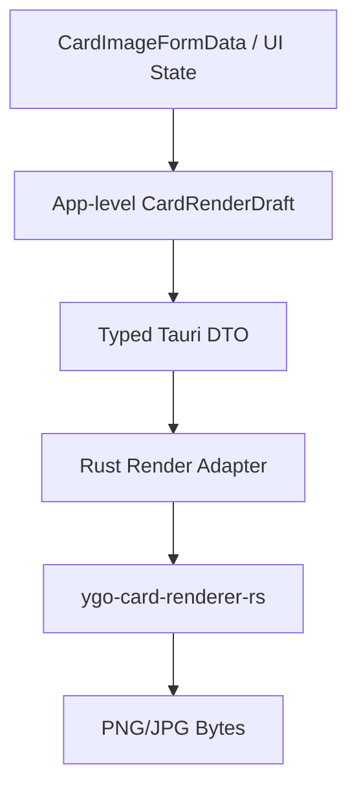

# DataEditorY 重构准备文档

生成时间：2026-05-18  
重构目标：为后续代码重构提供方向性文档。本文不包含逐行迁移步骤，重点描述重构目标、边界、目标架构、优先级与风险。

## 1. 总体重构目标

本轮重构以“稳定既有功能、降低维护成本、强化类型契约、为后续功能扩展提供清晰边界”为目标。

核心原则：

1. **行为保持一致**：尤其是 CDB 编辑、搜索、脚本编辑、打包、合并、制卡器导出行为，不应引入功能倒退。
2. **边界清晰**：区分 UI、controller、use case、domain、service、infrastructure。
3. **类型优先**：前端与 Rust 的 IPC 边界应有明确类型，不继续依赖 `unknown` 或隐式字段约定。
4. **重活下沉 Rust**：本地文件、图片处理、渲染、数据库、打包合并等重任务优先由 Rust 承担。
5. **可测试**：重构后的核心转换逻辑、IPC DTO、渲染请求构建、CDB 操作应可单独测试。

## 2. 重构范围分级

| 优先级 | 范围 | 说明 |
| --- | --- | --- |
| P0 | 卡图渲染完全重构 | 从 JS `yugioh-card` 迁移到 Rust `ygo-card-renderer-rs` 后，当前适配层应废弃重写，仅保留功能一致 |
| P1 | IPC 类型契约 | 前端 Tauri commands 与 Rust DTO 类型统一，消除 `unknown` |
| P1 | 制卡器状态拆分 | 拆分巨型 `controller.svelte.ts`，降低 UI 状态、裁剪、前景、渲染耦合 |
| P2 | 前端模块边界清理 | 清理兼容重导出、减少 utils 与 features 双向依赖 |
| P2 | Rust 错误模型统一 | 改善 `Result<_, String>` 的可维护性和错误定位 |
| P3 | 测试补齐 | 增加渲染契约、适配器、IPC DTO、关键业务流测试 |

## 3. 卡图渲染完全重构

### 3.1 背景

项目已从 JS 的 `yugioh-card` 切换到 Rust 的 `ygo-card-renderer-rs`。当前代码中已经存在基础接入：

- `src-tauri/Cargo.toml` 已依赖 `ygo-card-renderer-rs`
- `src-tauri/src/services/card_render.rs` 已调用 Rust renderer
- `src/lib/features/card-image/renderRequestMapper.ts` 已尝试构造 Rust 渲染 payload
- 前端通过 `renderCardImage()` 调用 Tauri `render_card`

但当前实现应视为**临时适配层**，不建议在其上继续小修小补。后续应按“完全重构”的方式处理。

### 3.2 当前问题

| 问题 | 影响 |
| --- | --- |
| 前端 `RenderCardPayload.request` 类型为 `unknown` | IPC 边界没有类型安全，字段变化无法提前发现 |
| `renderRequestMapper.ts` 手写 Rust 请求结构 | 与 Rust renderer 类型容易漂移 |
| 前端通过 canvas 合成 foreground overlay | 渲染职责分散，前端承担了本应由渲染器处理的图层逻辑 |
| art/foreground 通过 data URL 传输 | base64 编解码与临时文件写入带来性能和内存浪费 |
| password 有额外 override 逻辑 | 请求语义不干净，字段职责重复 |
| controller 同时管理裁剪、前景、导出、渲染刷新 | 状态复杂，难以测试和替换渲染后端 |
| 缺少渲染回归样例 | 无法确认“功能一致”是否达成 |

### 3.3 重构目标

卡图渲染重构后应满足：

1. **Rust renderer 是唯一卡图渲染核心**。
2. **前端不再构造 renderer 内部细节对象**，只提交稳定的应用级制卡请求。
3. **前端不再合成最终渲染图层**，只负责编辑参数、裁剪源图、展示结果。
4. **前后端契约明确**，Rust DTO 与 TypeScript 类型保持一致。
5. **支持现有功能一致性**：预览、导出 PNG、保存 JPG、卡图裁剪、字段编辑、语言、稀有度、文字颜色/渐变/阴影、前景图、效果框、场地魔法额外场地图导出等行为需保留。
6. **性能可控**：避免频繁 base64 大对象传输；对重复图像资源有缓存或引用机制。

### 3.4 目标架构

建议将渲染体系改为三层：



#### 3.4.1 前端应用级请求

前端应提交面向 DataEditorY 的请求，而不是直接提交 `ygo-card-renderer-rs::RenderRequest` 的内部结构。

建议概念模型：

```text
CardRenderDraft
  cardIdentity
  cardFrame
  localizedText
  stats
  artSource
  visualStyle
  foregroundLayer
  effectBlock
  outputOptions
```

该模型应表达“用户在制卡器中编辑了什么”，而不是“Rust renderer 需要怎样的内部节点”。

#### 3.4.2 Rust 渲染适配器

Rust 侧新增或重写渲染 adapter：

```text
DataEditorY Render DTO
  -> normalize / validate
  -> convert to ygo-card-renderer-rs RenderRequest
  -> render
  -> encode output
```

这样 renderer crate 的 API 变化只影响 Rust adapter，不影响前端表单和 UI。

#### 3.4.3 图像资源传输

应避免长期使用 data URL 作为主通道。可选方向：

| 方案 | 说明 |
| --- | --- |
| 临时资源句柄 | 前端上传/裁剪后写入临时文件，渲染请求只传 path/token |
| Rust 管理渲染资源缓存 | Rust 根据 token 读取缓存图片，预览重复渲染不重复传大对象 |
| 一次性 binary IPC | 对小图可传 bytes，但不再转 base64 data URL |

最终目标是：渲染请求只携带轻量参数与资源引用。

### 3.5 必须保持的功能一致性

| 功能 | 保持要求 |
| --- | --- |
| 卡片类型 | monster/spell/trap/pendulum，含 ritual/fusion/synchro/xyz/link/token |
| 位标志语义 | type/race/attribute/link marker/category 与 CDB 语义一致 |
| 多语言 | sc/tc/jp/kr/en/astral 默认文案和格式化行为保持一致 |
| 灵摆 | 灵摆描述/怪兽效果拆分、刻度、灵摆框架保持一致 |
| 图片 | 上传、旋转裁剪、预览、导出、保存到 `pics/<code>.jpg` |
| 场地魔法 | 保存 JPG 时继续额外生成 `pics/field/<code>.jpg` |
| 文字 | 名称、描述、密码、版权、包名、rare、laser、20th 等字段保持一致 |
| 样式 | 名称颜色、渐变、阴影、首行压缩、效果框、前景图保持一致 |
| 输出 | 预览 PNG、下载 PNG、保存 JPG 质量与尺寸策略保持可接受一致 |

### 3.6 重构后建议模块划分

#### 前端

```text
src/lib/features/card-image/
  adapter.ts                    CDB CardDataEntry -> 制卡表单默认值
  layout.ts                     表单 schema、选项、config import/export
  render/
    draft.ts                    CardImageFormData -> CardRenderDraft
    resources.ts                裁剪图/前景图资源准备
    client.ts                   调用 Tauri 渲染命令
    types.ts                    前端渲染 DTO 类型
  crop/
    controller.ts               裁剪状态和算法
  foreground/
    controller.ts               前景编辑状态和算法
  controller.svelte.ts          只保留抽屉级编排
```

#### Rust

```text
src-tauri/src/services/card_render/
  mod.rs                        对外服务入口
  dto.rs                        DataEditorY 渲染 DTO
  adapter.rs                    DTO -> ygo-card-renderer-rs RenderRequest
  resources.rs                  图片资源缓存、临时文件、清理
  bundle.rs                     renderer bundle 加载生命周期
  output.rs                     PNG/JPG 输出处理
```

### 3.7 不建议保留的当前实现

以下实现建议在重构中替换，而不是继续扩展：

| 当前实现 | 原因 |
| --- | --- |
| `renderRequestMapper.ts` 直接构造 Rust renderer 请求 | 前端不应依赖 renderer crate 内部模型 |
| `RenderCardPayload.request: unknown` | 类型安全不足 |
| foreground overlay 前端 canvas 合成 | 图层渲染职责应集中到 Rust renderer/adapter |
| `passwordText` 顶层 override | 应进入统一 DTO，避免特殊通道 |
| 每次预览传完整 data URL | 性能和内存开销过大 |

## 4. 制卡器前端状态重构

### 4.1 当前问题

`features/card-image/controller.svelte.ts` 同时承担：

- 抽屉开关与生命周期
- 表单 state
- 图片上传读取
- 图片裁剪
- 前景图编辑
- 渲染请求构造与刷新 debounce
- 导入/导出配置
- 下载 PNG / 保存 JPG
- AI 翻译
- 错误日志与 toast

这导致文件过大、修改风险高、测试困难。

### 4.2 目标方向

将 controller 拆为多个独立上下文：

| 子模块 | 职责 |
| --- | --- |
| Drawer Controller | 抽屉生命周期、当前 card hydration、功能编排 |
| Form Controller | 表单更新、默认值、语言切换、dirty/config import/export |
| Crop Controller | 原图读取、旋转、裁剪框、裁剪输出 |
| Foreground Controller | 前景图读取、透明裁剪、位置/缩放/旋转 |
| Render Controller | 预览刷新、导出 PNG/JPG、资源准备、错误状态 |
| Ai Controller | 翻译准备与结果写回 |

目标不是拆得越碎越好，而是确保每个 controller 有单一理由被修改。

## 5. IPC 类型契约重构

### 5.1 当前问题

前端 `src/lib/infrastructure/tauri/commands.ts` 中部分 command wrapper 类型较弱，尤其：

```ts
export type RenderCardPayload = {
  request: unknown;
  artImageDataUrl?: string;
  foregroundImageDataUrl?: string;
  passwordText?: string;
};
```

该类型无法表达真实字段，也无法在 Rust renderer API 变化时提供编译期反馈。

### 5.2 目标方向

1. 为所有跨 IPC 的复杂 DTO 建立明确类型。
2. 卡图渲染 DTO 以 DataEditorY 自有模型为准，而不是直接暴露 renderer crate 内部类型。
3. 后续可考虑从 Rust `serde` DTO 生成 TypeScript 类型，避免双端手写漂移。
4. 对关键命令增加契约测试或 JSON fixture。

## 6. Rust 后端重构方向

### 6.1 错误处理

当前多数服务返回 `Result<T, String>`，优点是简单，缺点是错误分类与定位能力不足。

建议方向：

- 为 services 引入统一错误类型或局部错误 enum。
- 命令层统一转换为前端可读错误字符串或结构化错误。
- 对文件不存在、权限、CDB 损坏、渲染失败、资源缺失等错误进行分类。

### 6.2 服务模块拆分

`services` 当前整体结构清晰，但部分文件较重：

| 文件 | 重构方向 |
| --- | --- |
| `card_render.rs` | 按 bundle/resources/dto/adapter/output 拆分 |
| `merge.rs` | 保持现状优先；如继续增长可拆分 plan/assets/execute |
| `package.rs` | 保持现状优先；可按 manifest/dependency/zip 拆分 |
| `media.rs` | 自定义 protocol 与文件工具可适度拆分 |

### 6.3 会话与临时文件

当前 CDB 编辑采用临时工作副本，这是合理设计。后续渲染资源缓存也应遵循类似原则：

- 资源生命周期可控
- 关闭标签或关闭抽屉时可清理
- Windows 文件占用问题要特别注意

## 7. 前端模块边界清理

### 7.1 `utils` 兼容导出

当前存在：

- `utils/cardImage.ts` → 重导出 `features/card-image/layout`
- `utils/cardImageAdapter.ts` → 重导出 `features/card-image/adapter`

这类兼容导出短期可保留，但长期会模糊模块归属。建议新代码直接引用真实模块，旧引用逐步迁移。

### 7.2 feature 与 service 边界

建议标准：

| 逻辑类型 | 放置位置 |
| --- | --- |
| 某个 UI 独有的交互状态 | `features/<feature>/controller` |
| 跨 UI 复用的业务动作 | `services/` |
| 无副作用纯规则 | `domain/` |
| 外部系统调用 | `infrastructure/` 或 Rust commands |

## 8. 测试补齐方向

### 8.1 卡图渲染重构必须补齐

| 测试类型 | 目标 |
| --- | --- |
| DTO 契约测试 | 确认前端请求 JSON 可被 Rust 正确反序列化 |
| Adapter 单元测试 | 确认不同卡片类型转换到 renderer request 正确 |
| 图片资源测试 | 确认裁剪图、前景图资源引用/清理正确 |
| 渲染 smoke test | 确认典型 monster/spell/trap/pendulum/link 能输出 PNG |
| 回归 fixture | 用固定输入比较关键渲染元数据或输出尺寸 |

### 8.2 其他测试方向

- Shell dirty-close guard
- CDB merge 冲突计划
- package Lua 依赖解析
- settings 密钥保存/清除
- script editor semantic diagnostics

## 9. 风险与控制

| 风险 | 控制方式 |
| --- | --- |
| 卡图渲染视觉差异 | 建立典型卡片 fixture，人工验收关键样例 |
| Rust renderer API 变化 | 只在 Rust adapter 层接触 renderer 内部类型 |
| 大图传输性能问题 | 使用资源 token/path/cache，避免 data URL 主通道 |
| 前端 controller 拆分引发状态不同步 | 先定义状态所有权，再迁移 |
| base/extra 构建差异破坏 | 重构时保持 capability/build stub 边界 |
| Windows 临时文件占用 | Rust 资源管理显式 drop/cleanup，避免长时间持有文件句柄 |

## 10. 推荐重构顺序（高层）

不展开具体步骤，仅建议阶段顺序：

1. **建立卡图渲染新 DTO 与目标边界**：先确定 DataEditorY 自有渲染请求模型。
2. **重写 Rust card_render 服务结构**：bundle、resource、adapter、output 分离。
3. **替换前端 renderRequestMapper**：改为生成应用级 DTO，不再构造 renderer 内部请求。
4. **替换图片传输方式**：从 data URL 过渡到资源引用/缓存。
5. **拆分制卡器 controller**：在渲染边界稳定后再拆状态，降低同时变更风险。
6. **补测试与回归样例**：确保功能一致性。
7. **清理旧兼容代码**：删除不再需要的 mapper、unknown 类型、旧工具重导出。

## 11. 完成标准

卡图渲染完全重构完成时，应满足：

- 前端没有 `RenderCardPayload.request: unknown`。
- 前端不直接构造 `ygo-card-renderer-rs` 内部 `RenderRequest`。
- `renderRequestMapper.ts` 被替换或显著缩减为应用级 DTO 转换。
- 前景、效果框、密码、稀有度、文字样式等功能通过统一 DTO 表达。
- 渲染资源不再主要依赖 base64 data URL 往返。
- Rust `card_render` 模块具备清晰子模块边界。
- 有基本渲染契约测试与 smoke test。
- 典型卡片预览、PNG 下载、JPG 保存、场地魔法场地图导出功能可用。

## 12. 非目标

本轮重构不建议同时处理：

- 更换 UI 框架或状态管理框架。
- 重写 CDB 编辑主流程。
- 重写 Lua 语义分析系统。
- 改变 base/extra 产品形态。
- 大规模修改 AI prompt/工具协议。

这些内容与卡图渲染重构耦合度低，若同时推进会显著放大风险。
